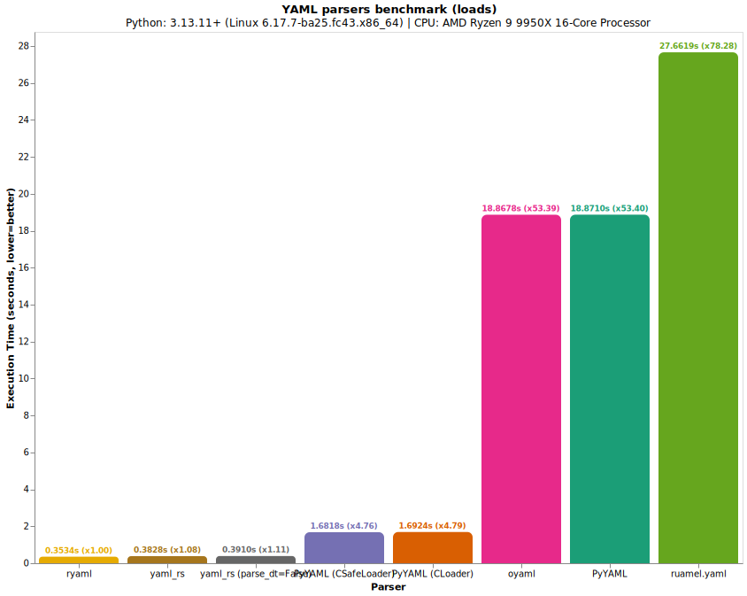
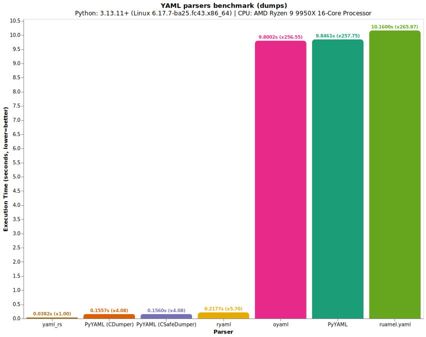

# ryaml benchmarks

These benchmarks come from [yaml-rs](github.com/lava-sh/yaml-rs).

## Create and activate virtual environment

```bash
# Linux / MacOS
python3 -m venv .venv
source .venv/bin/activate

# Windows
py -m venv .venv
.venv\scripts\activate
```

## Install benchmark dependencies

```bash
# Using pip
pip install -r benchmark/bench_requirements.txt

# Using uv
uv pip install -r benchmark/bench_requirements.txt
```

## Run `benchmark/run.py`

```bash
python benchmark/run.py
```

## Results

### loads



### dumps


